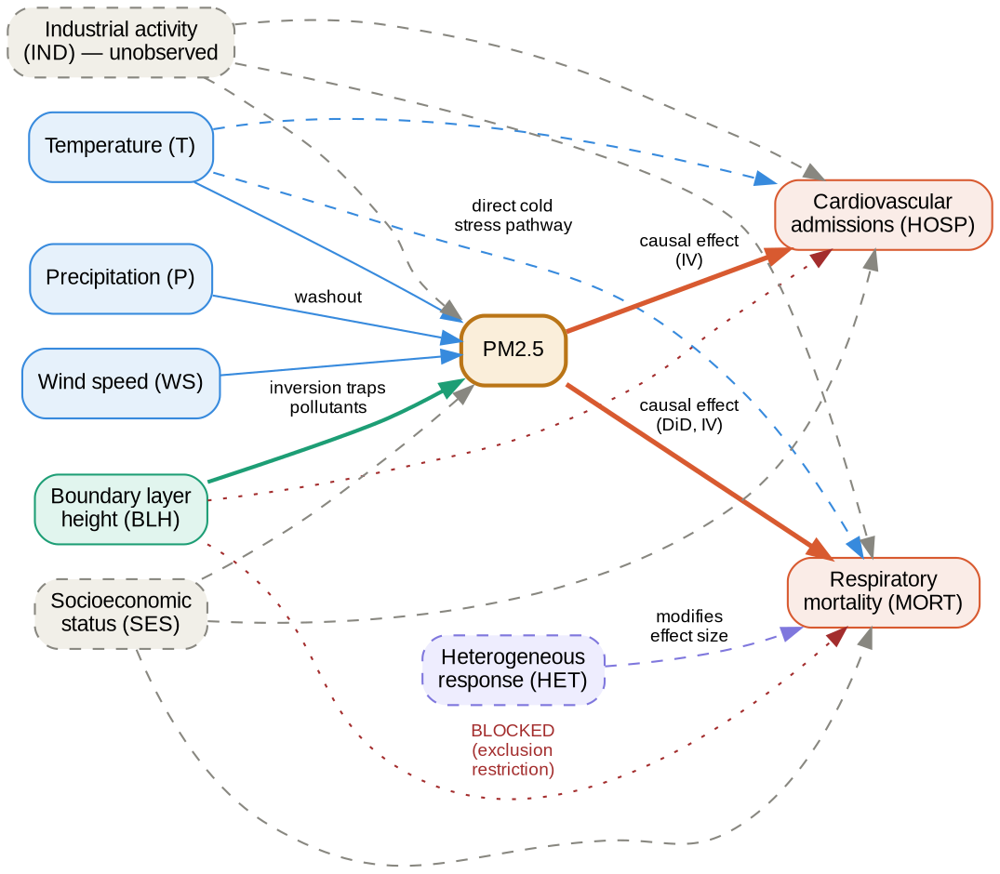

# Causal DAG

This document specifies the assumed causal structure of the PM2.5 → health outcome system. It is the foundation for all three causal analyses in the pipeline. Read this before [`CAUSAL_INFERENCE.md`](CAUSAL_INFERENCE.md).

---

## Why a DAG?

A Directed Acyclic Graph (DAG) makes causal assumptions explicit and auditable. Every arrow is a claim. Every absent arrow is also a claim — that no direct causal relationship exists between those two variables. By drawing the DAG before running any regression, we commit to a set of assumptions that can be critiqued, debated, and partially tested, rather than implicitly buried in a model specification.

The DAG also directly determines which variables to condition on and which to leave out. Conditioning on a collider (a variable caused by both treatment and outcome) opens a spurious path and biases estimates. Conditioning on a mediator blocks the causal path you are trying to measure. The DAG makes these structural decisions visible.

---

## Variables

| Variable | Symbol | Type | Source |
|---|---|---|---|
| Boundary layer height | BLH | Observed, continuous | ERA5 |
| Temperature | T | Observed, continuous | ERA5 |
| Wind speed | WS | Observed, continuous | ERA5 |
| Precipitation | P | Observed, continuous | ERA5 |
| Industrial activity | IND | **Unobserved**, continuous | — |
| Socioeconomic status | SES | Partially observed (GDP proxy) | EUROSTAT |
| PM2.5 concentration | PM2.5 | Observed, continuous → binary threshold | EEA |
| Co-pollutants (NO₂, PM10, SO₂, O₃) | CO | Observed, continuous | EEA |
| Respiratory mortality | MORT | Observed, weekly count | EUROSTAT / WHO |
| Cardiovascular admissions | HOSP | Observed, weekly count | EUROSTAT |
| Heterogeneous response | HET | Latent (age, urbanisation) | — |

---

## The DAG

```
                 ┌──────────────────────────────────────────────────────────┐
                 │                 ATMOSPHERIC LAYER                        │
                 │                                                          │
                 │   BLH ──────────────────────────────► PM2.5             │
                 │    │           (inversion traps         │                │
                 │    │            pollutants)             │                │
                 │    │                                    │                │
                 │   WS ──────────────────────────────────┤                │
                 │   T  ──────────────────────────────────┤                │
                 │   P  ──────────────────────────────────┘                │
                 │                                                          │
                 └──────────────────────────────────────────────────────────┘
                                        │
                                        │  causal effect
                                        │  (what we want to estimate)
                                        ▼
 ┌ ─ ─ ─ ─ ─ ─ ─ ─ ─ ─ ─ ─ ─ ─ ─ ─ ─ ─ ─ ─ ─ ─ ─ ─ ─ ─ ─ ─ ─ ─ ─ ─ ─ ─ ┐
   UNOBSERVED CONFOUNDERS                       HEALTH OUTCOMES
 │                                                                          │
   IND (industrial activity) ──────────────────► MORT (respiratory deaths)
 │         │                                                                │
           │          ───────────────────────────► HOSP (cardio admissions)
 │         │         │                                                      │
   SES (socioeconomic) ────────────────────────► MORT
 │         │         │                                                      │
           │         │                          (HET: age, urbanisation
 │         │         │                           modifies the PM2.5→health │
           └─────────┴──────────► PM2.5          effect size)
 │                                                                          │
 └ ─ ─ ─ ─ ─ ─ ─ ─ ─ ─ ─ ─ ─ ─ ─ ─ ─ ─ ─ ─ ─ ─ ─ ─ ─ ─ ─ ─ ─ ─ ─ ─ ─ ─ ┘

BLOCKED path (exclusion restriction):
  BLH  - - - - - - - - - - - - - - - - - - - - - X  MORT / HOSP
                (no direct biological pathway assumed)

CO-POLLUTANTS path:
  IND ──► CO (NO₂, PM10, SO₂, O₃) ──► MORT / HOSP
  PM2.5 and CO are co-caused by IND; conditioning on CO would partially
  block the IND→PM2.5 path (not a simple confounder — handle carefully)
```

---

## Machine-readable specification

### Graphviz (DOT format)

Save as `dag.dot` and render with `dot -Tpng dag.dot -o dag.png` or paste into [Graphviz Online](https://dreampuf.github.io/GraphvizOnline/).



---

### dagitty format

Paste into [dagitty.net](https://dagitty.net/dags.html) for interactive analysis, d-separation queries, and identification checks.

```
dag {
bb="0,0,1,1"
BLH [pos="0.1,0.3"]
T   [pos="0.1,0.5"]
WS  [pos="0.1,0.6"]
P   [pos="0.1,0.7"]
PM25 [exposure,pos="0.45,0.4"]
IND  [latent,pos="0.35,0.7"]
SES  [latent,pos="0.35,0.8"]
HET  [latent,pos="0.55,0.7"]
MORT [outcome,pos="0.8,0.3"]
HOSP [outcome,pos="0.8,0.5"]

BLH -> PM25
T   -> PM25
WS  -> PM25
P   -> PM25
T   -> MORT
T   -> HOSP
PM25 -> MORT
PM25 -> HOSP
IND -> PM25
IND -> MORT
IND -> HOSP
SES -> PM25
SES -> MORT
SES -> HOSP
HET -> MORT
}
```

In dagitty, you can query:
- `Are PM25 and MORT d-separated given {BLH, T, WS, P}?` → No (IND, SES open backdoors)
- `Is BLH a valid instrument for PM25 → MORT?` → Yes, conditional on {T, WS, P} blocking the T→MORT direct path
- `What adjustment set identifies PM25 → MORT?` → Not identifiable by adjustment alone (unobserved IND, SES) — requires IV or DiD

---

## Edge-by-edge justification

Every causal arrow in the DAG represents a maintained hypothesis. The following table documents the scientific basis for each edge and flags where the assumption is most contestable.

| Edge | Direction | Basis | Contestability |
|---|---|---|---|
| BLH → PM2.5 | Negative: lower BLH → higher PM2.5 | Atmospheric boundary layer physics: temperature inversions suppress vertical mixing, trapping pollutants near the surface. Well-established in atmospheric science literature. | Low — physically well-understood mechanism |
| T → PM2.5 | Negative (summer) / Positive (winter) | Temperature affects photochemical reactions (O₃ formation), heating demand, and inversion frequency. The relationship is non-linear and season-dependent. | Medium — direction reverses by season |
| WS → PM2.5 | Negative | Higher wind speed increases horizontal dispersion and reduces local pollutant concentration. | Low |
| P → PM2.5 | Negative | Wet deposition (rainout/washout) removes particulate matter from the atmosphere. | Low |
| PM2.5 → MORT | Positive | Extensive epidemiological and toxicological literature. PM2.5 penetrates deep into lungs and crosses into bloodstream, causing cardiovascular and respiratory disease. WHO 2021 guidelines cite overwhelming evidence. | Low for existence; medium for magnitude |
| PM2.5 → HOSP | Positive | Same mechanism as above; acute hospitalisation is a faster response than mortality, so the effect should be detectable at shorter lag. | Low for existence; medium for lag structure |
| IND → PM2.5 | Positive | Industrial combustion is a major source of fine particulate matter. | Low |
| IND → MORT | Positive | Industrial areas have higher occupational exposure, noise, and chemical pollutant burden beyond PM2.5. | Medium — hard to disentangle from PM2.5 pathway |
| SES → PM2.5 | Positive (lower SES → higher PM2.5) | Lower-income populations disproportionately live near industrial zones, highways, and ports. | Medium |
| SES → MORT | Positive (lower SES → higher mortality) | Well-established social determinants of health literature. | Low |
| T → MORT | Positive (cold) / U-shaped | Cold temperatures directly increase cardiovascular stress; extreme heat also increases mortality. This is the most important direct confounder for the BLH → health exclusion restriction. | Low — included as control variable |
| HET → MORT | Modifies PM2.5→MORT effect size | Elderly populations have lower respiratory reserve; urban populations have chronic prior exposure; estimated by Causal Forest. | Medium — latent construct |

---

## Absent edges — what we assume does NOT exist

These absent edges are as important as the ones present. Each one is a maintained assumption.

| Absent edge | Assumption | Risk if wrong |
|---|---|---|
| BLH → MORT (direct) | No biological mechanism by which atmospheric boundary layer height directly affects cardiovascular health, other than through PM2.5. | IV estimate is biased if BLH affects health through a pathway we haven't controlled for. Partially addressed by controlling for T. |
| BLH → HOSP (direct) | Same as above. | Same. |
| P → MORT (direct) | Precipitation has no direct cardiovascular health effect other than through pollutant removal. | Low risk — well-supported assumption. |
| CO → MORT (independent of PM2.5) | Co-pollutants (NO₂, PM10, SO₂, O₃) are treated as features for the predictive model, not as independent causal pathways in the IV analysis. | If NO₂ has a causal effect on health independent of PM2.5, and NO₂ correlates with BLH, the exclusion restriction is violated. Sensitivity analysis: re-run IV controlling for NO₂. |

---

## Identification strategies mapped to the DAG

| Strategy | Backdoor paths blocked | Residual threats |
|---|---|---|
| **DiD** | IND and SES are assumed to evolve in parallel for treated and control NUTS3 regions → parallel trends assumption blocks the backdoor | Non-parallel trends in IND or SES between treated and control regions; spillover effects from treated to control regions |
| **IV (BLH)** | BLH is not caused by IND or SES → opens an identified path from BLH to PM2.5 to health | Exclusion restriction violation (BLH → health direct path); weak instrument (F < 10) |
| **Causal Forest** | Conditions on observed W (T, WS, P, ERA5 covariates) → blocks observed backdoors | Unobserved IND and SES remain as threats; assumes conditional unconfoundedness |

No single method closes all backdoors. Using all three together, with consistent results across methods, provides stronger evidence than any single analysis alone.

---

## Changelog

| Version | Date | Change |
|---|---|---|
| 0.1 | 2024-01-15 | Initial DAG — core variables and IV instrument |
| 0.2 | 2024-03-01 | Added HET node (Causal Forest heterogeneity); added SES as partially observed confounder; added dagitty representation |
| 0.3 | 2024-06-10 | Added T → MORT direct edge; documented exclusion restriction threat from temperature; added CO absent-edge note |

*The DAG should be updated whenever a new variable is added to the feature store or a new causal pathway is hypothesised. Version it alongside the code.*
